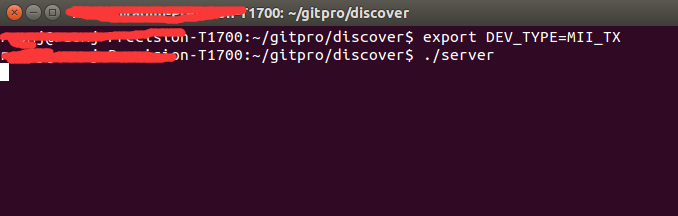
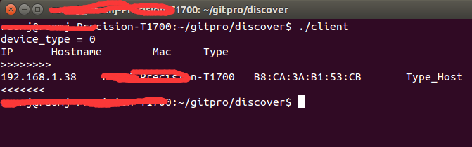

## 功能
A tools

src 中包含client和server程序
通过运行client程序能够发现局域网内的设备

## 编译
```
$ cd discovery/src
$ make

```

## 结果
本机设置DEV_TYPE环境变量，启动服务端

`$./server`



启动客户端

`$./client`



##反馈
在使用中有任何问题，欢迎反馈给我，可以用以下联系方式跟我交流

* 邮件(mjrao#foxmail.com, 把#换成@)
